# simpleERP 系統架構

滴雞精的庫存管理。賣家建立訂單之後可以分批出貨。每一筆出貨只走一條路：

- **官方契約**：用黑貓契客印單，宅配到收件地址。系統存託運單 PDF。
- **產生代碼**：用 7-ELEVEN 交貨便。系統把收貨資料送出，取回 12 碼，賣家到 ibon 手打這組數字印單再交櫃檯。

同一張訂單的不同次數出貨可以各選各的。100 盒可以今天用黑貓寄 10 盒、下次用交貨便再寄 10 盒。

這份文件只決定邊界與資料怎麼切。黑貓欄位以契約客戶拿到的官方文件為準。交貨便欄位以綠界 [門市訂單建立](https://developers.ecpay.com.tw/8809/) 為準。

先做 ERP。綠界帳號、黑貓印單 API 都排在後面。沒有這兩家，仍然可以記訂單、扣庫存、分批出貨。

## 1. 要做的事

賣家替客戶建立訂單，例如「王小明，原味滴雞精 100 盒」。貨不必一次寄完。今天出 10 盒就建立一筆出貨，訂單剩下 90 盒。

第一版只服務這一位賣家自己用，不在系統裡收款、不開發票。

| 要做 | 不做（第一版） |
| --- | --- |
| 登入、商品、客戶（地址與取貨門市都留） | 金流、發票、會計、貨到付款 |
| 進貨入庫 | 多倉庫、批號、效期 |
| 訂單，以及同一張訂單多次出貨 | 退貨入庫、門市關轉後自動改店 |
| 出貨時二選一：黑貓契客印單，或交貨便 12 碼 | 自己編 QR；拿黑貓契客單去 7-11；7-11 交貨便以外的超商 |
| 看出貨進度、託運單號或 12 碼 | 多帳號、權限分級；黑貓 FTP 自動貨態 |

## 2. 兩條出貨路

| | 官方契約 | 產生代碼 |
| --- | --- | --- |
| 誰送 | 黑貓宅急便，契約月結 | 7-ELEVEN 交貨便，店到店 |
| 收件資料 | 姓名、電話、地址 | 證件上的真實姓名、09 開頭手機、取貨門市代碼 |
| 系統向誰要單 | 黑貓雲端印單 API | 綠界 `UNIMARTC2C` |
| 賣家拿到什麼 | 託運單 PDF，印出來貼上 | 12 碼。到 ibon 手打後印單 |
| 沒有印表機 | 黑貓寄取站，或請司機到府印單。前提是 API 有回黑貓自己的列印碼 | 到任一間 7-ELEVEN，ibon 代碼輸入打 12 碼 |
| 不能做的事 | 這張單不能拿去 7-11 ibon | 這組碼不能當黑貓託運單號 |

ibon 認的是交貨便 12 碼。黑貓契客單號打進去不會印出單。兩組號碼分欄位存，畫面也分開顯示。

```mermaid
flowchart LR
  seller[賣家瀏覽器]
  app[ASP.NET Core]
  db[(SQLite)]
  r2[(R2 黑貓 PDF)]
  tcat[黑貓契客印單]
  ecpay[綠界交貨便]
  ibon[7-ELEVEN ibon]

  seller --> app
  app --> db
  app --> r2
  app --> tcat
  app --> ecpay
  seller --> ibon
```

### 官方契約

契約帳號要開通線上印單，取得契客代號（CustomerId）與授權碼（CustomerToken）。已有客代時，在[統一速達契客專區](https://www.takkyubin.com.tw/YMTContract/aspx/Login.aspx)申請授權碼。說明見[契約客戶專區](https://www.t-cat.com.tw/contract/business.aspx)。

出貨成功後立刻下載 PDF，存進 R2。實務上補印窗口常常只有約 24 小時，之後從我們自己的系統下載。

沒有印表機時，[SmartCat](https://www.t-cat.com.tw/contract/scat.aspx) 官方寫的是到黑貓寄取站掃 QR，或請司機到府掃 QR 印單。那組 QR 必須是黑貓發的。API 沒回列印碼，這一筆就只有 PDF。

不要接 2019 年那份 [EGS HTTP API](http://tw3.ezcat.com.tw/EGS_HTTP_API_Reference_20190530_SUDA.pdf)。那是打到 Windows 本機 `localhost:8800/egs` 的閘道。

第一版印單：寄件人來自設定，收件人用這一筆的地址快照，溫層用這筆出貨的溫層，件數 1，代收金額 0。品名用商品短品名；一箱多個品項時，出貨前由賣家確認列印名稱。部分後台限制約 20 個中文字，介面要擋超長。同一張託運單不混溫層。滴雞精預設常溫。

建單失敗不扣庫存。貨態第一版不接 FTP，畫面上放黑貓查貨連結，賣家手動標已配達。

### 產生代碼

收貨資料先寫進 SQLite。按下出貨後，網站呼叫綠界建立 7-ELEVEN 交貨便。成功才有 12 碼：

- `CVSPaymentNo`：8 碼寄貨編號
- `CVSValidationNo`：4 碼驗證碼
- 兩者接起來就是賣家要打的 12 碼

畫面用大字顯示這 12 碼。賣家到 ibon：購物／寄貨 → 交貨便 → 寄件 → 代碼輸入。步驟見[交貨便寄件規範](https://support.ecpay.com.tw/34586/)。手打是這條路的正式用法。

同一組 12 碼可以另外畫成 QR，方便自己備存。ibon 掃描認不認這張圖，文件沒有保證，不當作必要步驟。

取件人姓名必須是證件上的真實姓名。門市代碼來自綠界電子地圖。物流子類型固定 `UNIMARTC2C`。第一版不代收貨款。

代碼建立後約 5 天內要寄出。包裹最長邊不超過 45 公分，長加寬加高不超過 105 公分，重量不超過 10 公斤。這條是常溫店到店。冷藏、冷凍不走 C2C。

運費依綠界公告，取貨不付款每筆 65 元，由綠界從賣家的物流帳戶結算，門市不先收。見[物流費用](https://www.ecpay.com.tw/IntroTransport/Service_Fee)。取得編號時會先預扣，沒有交寄會在約 10 天後退回。額度不夠就取不到代碼。見[費用說明](https://support.ecpay.com.tw/15275/)。

## 3. 部署

語言用 C#，一個 ASP.NET Core 網站同時做畫面與 API。訂單、庫存、兩家物流都是表單和 HTTP 呼叫，用同一個專案即可，不必再加一套前端語言。

Cloudflare Workers 執行的是 JavaScript。C# 編成 WebAssembly 再放上去仍是實驗做法，程式體積也常超過免費方案的上限，而且接不到資料庫的原生介面。所以網站改放 [Azure App Service 免費層 F1](https://azure.microsoft.com/en-us/pricing/details/app-service/windows/)，網址先用 `*.azurewebsites.net`。

F1 是試用層，微軟寫明不支援正式工作負載，也沒有 SLA。限制包括每天 60 分鐘 CPU、每天約 165 MB 流出流量、1 GB 記憶體、1 GB 磁碟，而且不能 Always On。見 [App Service 限制](https://learn.microsoft.com/en-us/azure/azure-resource-manager/management/azure-subscription-service-limits)。一位賣家一天出幾次貨，通常在這個額度裡。超過當天 CPU 或流量，網站會停到隔日重置。

資料庫用網站上的一個 SQLite 檔。F1 只有一個執行個體，這種單人出貨不會同時寫入。黑貓 PDF 仍放 [R2](https://developers.cloudflare.com/r2/pricing/)，避免把 1 GB 磁碟塞滿。

網站與資料庫的主機費是 0 元。交貨便的 65 元是運費。黑貓運費走既有契約帳單。

[Vercel Hobby](https://vercel.com/docs/plans/hobby) 僅限個人、非商業使用，見 [Fair Use Guidelines](https://vercel.com/docs/limits/fair-use-guidelines)。賣家出貨不放在 Hobby 上。

| 角色 | 服務 | 為什麼 |
| --- | --- | --- |
| 畫面與 API | ASP.NET Core，Azure App Service F1 | 免費層能跑 C# |
| 資料 | SQLite 檔，放在網站磁碟 | 單人使用，不另租資料庫 |
| 黑貓 PDF | R2 | 免費 10 GB，下載不計 R2 流量費；Azure 流出仍吃 F1 的 165 MB |
| 契約印單 | 黑貓雲端印單 API | 宅配 |
| 交貨便代碼 | 綠界物流 | ibon 手打的 12 碼 |

瀏覽器只打我們的 API。黑貓授權碼、綠界 HashKey 與 HashIV 只放 App Service 的應用程式設定。

## 4. 訂單和出貨是兩件事

訂單回答「客戶總共要多少、還欠多少」。出貨回答「這一次走哪一條路、寄出多少、單號或 12 碼是什麼」。

例子：訂單 100 盒。

| 順序 | 動作 | 已出 | 未出 | 這一筆 |
| --- | --- | --- | --- | --- |
| 1 | 建立訂單 | 0 | 100 | 還沒有單 |
| 2 | 官方契約，出 10 | 10 | 90 | 黑貓託運單 A |
| 3 | 產生代碼，出 10 | 20 | 80 | 交貨便 12 碼 B |
| … | 直到未出為 0 | 100 | 0 | 每筆出貨各一張單 |

規則：

- 單次出貨數量必須大於 0，而且不可超過該訂單明細的未出數量。
- 一次出貨只建立一個包裹。官方契約是一張託運單；產生代碼是一組 12 碼。一箱放不下就再出一筆。
- 訂單狀態由數量算出：未出等於訂購量是「未出貨」；已出大於 0 且仍有未出是「部分出貨」；未出為 0 是「已出完」；整張取消是「已取消」。
- 已經出過貨的訂單不能整張刪除。只能取消還沒出的剩餘數量。已成立的託運單或 12 碼維持不變。

一張訂單可以有多個品項。出貨時按品項填本次數量。

## 5. 庫存怎麼扣

- **在庫**：倉庫裡實際有的數量。
- **已承諾未出**：所有未完成訂單的未出數量合計。
- **可再賣** = 在庫 − 已承諾未出。

| 動作 | 在庫 | 已承諾未出 | 可再賣 |
| --- | --- | --- | --- |
| 進貨 120 | 120 | 0 | 120 |
| 客戶下單 100 | 120 | 100 | 20 |
| 出 10，賣家確認出貨 | 110 | 90 | 20 |

建立訂單只佔用可再賣數量。賣家確認出貨之後，才同時減少在庫與已承諾未出。

第一階段沒有接物流 API，確認出貨就扣庫存。單號或 12 碼可以當下手動填，也可以事後補。後面接上黑貓或綠界時，改成對方建單成功才扣；失敗不扣。

其他約束：

- 新訂單數量不可超過當時的可再賣。
- 出貨數量不可超過該明細未出數量，也不可超過在庫。
- 手動調庫存時，不可把在庫調到低於已承諾未出。
- 取消訂單的未出部分會釋出承諾，在庫不變。
- 進貨、出貨、調整都留一筆庫存流水，畫面上的在庫以流水加總為準。

## 6. 賣家會走的流程

1. 登入。
2. 設定寄件人。黑貓要名稱、電話、地址。交貨便要真實姓名與 09 開頭手機。兩組金鑰都放 App Service 的應用程式設定。
3. 建立商品：名稱、單位（盒或瓶）、溫層、短品名。
4. 進貨入庫。
5. 建立客戶：姓名、電話、地址，以及預設取貨門市（給交貨便用）。
6. 建立訂單。
7. 按「出貨」，填本次數量，選擇官方契約或產生代碼，確認這一筆要的收件資料。
8. 第一階段：畫面上手動填黑貓單號或交貨便 12 碼，確認後扣庫存。後面接上 API 之後，改由黑貓回 PDF、或綠界回 12 碼，成功才扣庫存。
9. 訂單列表看出未出數量。賣家依單號或 12 碼查貨，並手動標完成。

## 7. 資料表

識別碼用文字型的 UUID。時間存 UTC。數量用整數。

**users**  
賣家登入。第一版只有一筆：帳號、密碼雜湊。

**settings**  
寄件人姓名、電話、地址、手機。黑貓契客代號、綠界商店代號可存在這裡方便核對。授權碼與 HashKey、HashIV 不進資料庫。

**products**  
sku、名稱、單位、溫層（常溫 / 冷藏 / 冷凍）、短品名。交貨便只用常溫品項。

**customers**  
姓名、電話、地址、預設取貨門市代碼與門市名稱。

**orders**  
客戶、備註、建立時間、取消時間。狀態由明細計算。

**order_lines**  
訂單、商品、訂購數量。已出數量由出貨明細加總，不在這張表另存。

**shipments**  
所屬訂單、通路（`tcat` 或 `unimart_c2c`）、收件快照、建單是否成功、貨態、建立時間。

官方契約的快照是姓名、電話、地址、溫層。另外存黑貓託運單號、R2 上的 PDF 物件鍵。黑貓若有回列印碼，另存，沒有就留空。

產生代碼的快照是姓名、手機、門市代碼、門市名稱。另外存綠界物流交易編號、8 碼、4 碼、12 碼。

**shipment_lines**  
出貨、訂單明細、本次數量。

**stock_movements**  
商品、數量（入庫為正、出貨為負）、原因（進貨 / 出貨 / 調整）、關聯的出貨或備註、時間。

外部呼叫的原始回應記在 **shipment_logs**（出貨、通路、動作、成功或失敗、回應摘要、時間）。

## 8. 程式邊界

庫存與訂單不直接組黑貓或綠界的請求。出貨只呼叫對應的一個轉接：

- `createTcatWaybill(shipment)`：回傳託運單號；若有列印碼一併帶回。
- `downloadTcatLabel(waybill)`：回傳 PDF，寫入 R2。
- `createCvsShipment(shipment)`：回傳物流交易編號與 12 碼。

建單成功才寫入單號或 12 碼、庫存流水與出貨明細。

## 9. 身分與秘密

- 第一版一個賣家帳號，密碼只存雜湊，工作階段用 HttpOnly cookie。
- 黑貓 `CustomerToken`、綠界 HashKey 與 HashIV 只放 App Service 的應用程式設定。
- 託運單 PDF 與交貨便 12 碼只在登入後顯示。PDF 不設公開網址。
- 儲存庫不提交 `.dev.vars`、`.env`。

## 10. 免費額度

一位賣家、一天幾十筆出貨，SQLite 與 R2 都很寬。要守住的是 Azure F1 的每天 60 分鐘 CPU 和約 165 MB 流出。交貨便每筆寄出仍是 65 元，黑貓運費走契約帳單。

| 服務 | 免費額度（文件所載） | 這套系統的用量 |
| --- | --- | --- |
| App Service F1 | 每天 60 分鐘 CPU、約 165 MB 流出、1 GB 磁碟。見 [定價](https://azure.microsoft.com/en-us/pricing/details/app-service/windows/) 與 [限制](https://learn.microsoft.com/en-us/azure/azure-resource-manager/management/azure-subscription-service-limits) | 內部出貨。PDF 不要重複整包下載 |
| SQLite | 吃 F1 的 1 GB 磁碟 | 訂單與流水都是小表 |
| R2 | 每月 10 GB、Class A 100 萬次、Class B 1000 萬次，對外下載不計 R2 費用。見 [R2 定價](https://developers.cloudflare.com/r2/pricing/) | 黑貓託運單 PDF |

列表查詢要加索引（訂單建立時間、出貨的訂單與通路、庫存流水的商品）。

## 11. 分階段

### 第一階段：ERP

做完就可以記真實訂單。不必辦綠界，也不必接黑貓 API。

- 登入、商品、進貨
- 客戶（地址與取貨門市先存著）
- 訂單、同一張訂單多次出貨
- 出貨時選官方契約或產生代碼，單號或 12 碼手動填
- 在庫、已承諾未出、可再賣

先在自己的電腦跑。Azure 等到要給日常使用再部署。

### 第二階段：產生代碼

辦綠界個人賣家，開通交貨便。出貨改為呼叫綠界，成功才顯示 12 碼、才扣庫存。到 7-ELEVEN 手打試印。

### 第三階段：官方契約

接黑貓測試區，建單、下載 PDF、存 R2。失敗不扣庫存。再用一筆少量正式出貨試印。

黑貓 FTP 自動貨態、退貨、收款、發票都不在這三階段裡。
