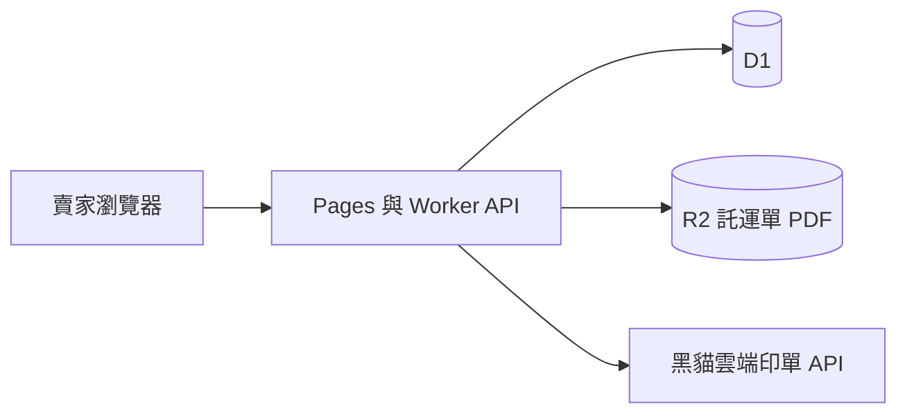

# simpleERP 系統架構

滴雞精的庫存管理。賣家建立訂單之後，可以分批出貨，每一次出貨向黑貓取得託運單號並列印標籤。

這份文件只決定邊界與資料怎麼切。實作時以這份為準；黑貓欄位名稱以契約客戶拿到的官方文件為準。

## 1. 要做的事

賣家（系統的使用者）替客戶建立訂單，例如「王小明，原味滴雞精 100 盒」。貨不必一次寄完。今天出 10 盒就建立一筆出貨、印一張黑貓託運單，訂單剩下 90 盒。出完才算這張訂單結束。

第一版只服務這一位賣家自己用，不是公開商城，不收款、不對帳。

| 要做 | 不做（第一版） |
| --- | --- |
| 登入、商品、客戶 | 金流、發票、會計 |
| 進貨入庫 | 多倉庫、批號、效期 |
| 訂單，以及同一張訂單多次出貨 | 退貨入庫 |
| 出貨時呼叫黑貓印單，存下託運單 PDF；若黑貓有回列印碼，再顯示 QR | 自己產生 QR 給 ibon 或司機掃；7-11 交貨便 |
| 看出貨進度與託運單號 | 多帳號、權限分級 |

## 2. 部署：放 Cloudflare，不放 Vercel Hobby

目標是月費 0 元，而且要拿來實際出貨。

[Vercel Hobby](https://vercel.com/docs/plans/hobby) 僅限個人、非商業使用。商業使用必須改 Pro 或 Enterprise，見 [Fair Use Guidelines](https://vercel.com/docs/limits/fair-use-guidelines)。這套系統是賣家拿來出貨、完成銷售，不放在 Hobby 上。

因此網站、API、資料庫、託運單檔案都放在同一個 Cloudflare 免費帳號：

| 角色 | 服務 | 為什麼 |
| --- | --- | --- |
| 畫面與 API | Cloudflare Pages + Workers（TypeScript） | 免費額度內可當正式環境，和資料庫同一家 |
| 資料 | [D1](https://developers.cloudflare.com/d1/platform/pricing/)（SQLite） | Workers 用 binding 直連，不必再架一層轉接 |
| 託運單 PDF | [R2](https://developers.cloudflare.com/r2/pricing/) | 免費 10 GB，對外下載不計流量費 |

瀏覽器只打我們的 API。D1、R2、黑貓契客代號與授權碼都留在 Worker，不進前端。

網址先用 `*.pages.dev`，不買網域。自有網域之後再綁，綁定本身不加價，網域註冊費另計。

若以後願意付費，再考慮把網站搬到 Vercel Pro。訂單、出貨、庫存的資料表不用為此重設計。

## 3. 訂單和出貨是兩件事

訂單回答「客戶總共要多少、還欠多少」。出貨回答「這一次實際寄出多少、黑貓單號是什麼」。

例子：訂單 100 盒。

| 順序 | 動作 | 已出 | 未出 | 黑貓 |
| --- | --- | --- | --- | --- |
| 1 | 建立訂單 | 0 | 100 | 還沒有單 |
| 2 | 出貨 10 | 10 | 90 | 託運單 A |
| 3 | 出貨 10 | 20 | 80 | 託運單 B |
| … | 直到未出為 0 | 100 | 0 | 每筆出貨各一張 |

規則：

- 單次出貨數量必須大於 0，而且不可超過該訂單明細的未出數量。
- 第一版一次出貨只建立一張黑貓託運單、一個包裹。10 盒若要分兩箱寄，就建立兩筆出貨。
- 訂單狀態由數量算出，不另存一份會互相打架的狀態：未出等於訂購量是「未出貨」；已出大於 0 且仍有未出是「部分出貨」；未出為 0 是「已出完」；整張取消是「已取消」。
- 已經出過貨的訂單不能整張刪除。只能取消還沒出的剩餘數量。已寄出的包裹維持原託運單。

一張訂單可以有多個品項（例如原味 60、滴雞精禮盒 40）。出貨時按品項填本次數量，不必一次把所有品項寄完。

同一張託運單不混溫層。滴雞精預設常溫；若商品設成冷藏，就跟常溫分開出貨。

## 4. 庫存怎麼扣

庫存有兩個數：

- **在庫**：倉庫裡實際有的數量。
- **已承諾未出**：所有未完成訂單的未出數量合計。
- **可再賣** = 在庫 − 已承諾未出。

| 動作 | 在庫 | 已承諾未出 | 可再賣 |
| --- | --- | --- | --- |
| 進貨 120 | 120 | 0 | 120 |
| 客戶下單 100 | 120 | 100 | 20 |
| 這張訂單出 10 | 110 | 90 | 20 |

建立訂單時只佔用可再賣數量，不把貨從在庫拿掉。出貨時才同時減少在庫與已承諾未出。這樣「還沒寄出的 90 盒」仍然在倉庫，但不會被另一張新訂單賣掉。

其他約束：

- 新訂單數量不可超過當時的可再賣。
- 出貨數量不可超過該明細未出數量，也不可超過在庫。
- 手動調庫存時，不可把在庫調到低於已承諾未出。
- 取消訂單的未出部分會釋出承諾，在庫不變。
- 進貨、出貨、調整都留一筆庫存流水，畫面上的在庫以流水加總為準。

## 5. 賣家會走的流程

1. 登入。
2. 設定寄件人：名稱、電話、地址、黑貓契客代號與授權碼（授權碼只寫進 Worker secret，不回傳給瀏覽器）。
3. 建立商品：名稱、單位（盒或瓶）、溫層、印在託運單上的短品名。
4. 進貨入庫。
5. 建立客戶與訂單。
6. 在訂單上按「出貨」，填本次各品項數量，確認收件人與地址。
7. 系統呼叫黑貓建立託運單，立刻把 PDF 存進 R2，畫面上可再下載、列印。
8. 訂單列表看出未出數量。包裹送達前，賣家可依黑貓查貨頁手動把該筆出貨標成已配達。

## 6. 資料表

識別碼用文字型的 UUID。時間存 UTC。數量用整數。

**users**  
賣家登入。第一版只有一筆：帳號、密碼雜湊。

**settings**  
寄件人名稱、電話、地址、預設溫層。黑貓契客代號可存在這裡方便核對；授權碼不進資料庫，只放 Worker secret。

**products**  
sku、名稱、單位、溫層（常溫 / 冷藏 / 冷凍）、託運單短品名。

**customers**  
名稱、電話、地址。出貨時可以改這一筆的收件資料，不回寫客戶主檔，除非賣家另外按儲存。

**orders**  
客戶、備註、建立時間、取消時間。狀態由明細計算。

**order_lines**  
訂單、商品、訂購數量。已出數量由出貨明細加總，不在這張表另存，避免和出貨紀錄不一致。

**shipments**  
所屬訂單、收件人快照（姓名、電話、地址）、溫層、包裹件數（第一版固定 1）、黑貓託運單號、印單是否成功、R2 上的 PDF 物件鍵、列印碼與 QR 內容（黑貓沒回就留空）、貨態（已建單 / 已配達 / 建單失敗）、建立時間。

**shipment_lines**  
出貨、訂單明細、本次數量。

**stock_movements**  
商品、數量（入庫為正、出貨為負）、原因（進貨 / 出貨 / 調整）、關聯的出貨或備註、時間。

黑貓呼叫的原始回應另記在 **shipment_logs**（出貨、動作、成功或失敗、回應摘要、時間），方便對單號，不把完整授權過程寫進一般列表。

## 7. 黑貓串接

契約帳號還要開通線上印單，取得契客代號（CustomerId）與授權碼（CustomerToken）。已有客代時，可在[統一速達契客專區](https://www.takkyubin.com.tw/YMTContract/aspx/Login.aspx)的「取得印單 API 授權碼」申請。說明見黑貓[契約客戶專區](https://www.t-cat.com.tw/contract/business.aspx)與常見開店系統的申請步驟，例如 [1shop 的申請說明](https://support.1shop.tw/%E7%94%B3%E8%AB%8B%E9%BB%91%E8%B2%93%E5%AE%85%E6%80%A5%E4%BE%BFapi%E4%B8%B2%E6%8E%A5/)。

程式只依賴一個轉接介面，其餘業務邏輯不直接組黑貓的請求：

- `parseAddress(address)`：地址轉成黑貓要的郵碼。
- `createWaybill(shipment)`：建立託運單，回傳託運單號；若回應裡有列印碼或 QR 內容，一併帶回。
- `downloadLabel(waybill)`：取回 PDF。

正式 URL、測試區、欄位名稱以黑貓交給契約客戶的文件為準。市面上插件常見的是雲端印單（建立託運單、下載 PDF、解析地址），取得單號後應立刻下載 PDF。實務上補印窗口常常只有約 24 小時，所以成功當下就寫入 R2，之後從我們自己的系統下載。

### 條碼：PDF、黑貓列印碼、7-11 交貨便

這三個不是同一張碼。

| 用途 | 誰發這組碼 | 第一版 |
| --- | --- | --- |
| 貼在箱子上給司機掃 | 託運單 PDF 裡已經有條碼 | 做。下載並列印 PDF |
| 沒有印表機時，給黑貓寄取站櫃台或到府司機掃，由他們印單 | 黑貓系統。契約客戶的 [SmartCat](https://www.t-cat.com.tw/contract/scat.aspx) 就是掃這組 QR | 黑貓 API 有回列印碼或 QR 內容才顯示。沒有就不做假的 |
| 到 7-ELEVEN ibon 掃碼印出黑貓託運單再交櫃檯 | 一般人走 [icat 網路宅急便](https://www.t-cat.com.tw/consign/info.aspx)，ibon 認的是那筆預約的 QR 或列印碼 | 只有契客印單 API 也回同一種碼才開放。這點要問黑貓業務，公開文件沒有保證 |
| 7-11 交貨便（店到店） | 統一超商／交貨便，和黑貓契客帳號無關 | 不做 |

系統不自己組 QR。ibon、黑貓智能櫃台、到府司機只認黑貓發的列印碼；用託運單號另外畫一張，機器掃了不會印出單。

速達印單 API 在常見金流模組裡回的是 PDF，不是 ibon 用的列印碼。實作前先跟黑貓確認這組契客代號的印單 API 是否包含「超商列印」或「寄取站列印」，以及回應欄位裡有沒有列印碼。有，出貨成功畫面就顯示 QR（由列印碼在瀏覽器畫出來，不必另存圖檔）和數字列印碼，方便沒帶印表機時到 7-ELEVEN 或黑貓寄取站。沒有，這一筆就只有 PDF。

不要接 2019 年那份 [EGS HTTP API](http://tw3.ezcat.com.tw/EGS_HTTP_API_Reference_20190530_SUDA.pdf)。那是裝在 Windows 本機、打到 `localhost:8800/egs` 的閘道，沒辦法放在 Cloudflare Worker 上。

第一版印單需要的資料：

- 寄件人：來自 settings。
- 收件人姓名、電話、地址：來自這筆出貨的快照。
- 溫層：這筆出貨的溫層。
- 品名：商品短品名；一箱有多個品項時，由賣家出貨前確認列印用名稱。部分後台限制品名約 20 個中文字，介面要擋超長。
- 件數：1。
- 代收貨款：第一版不使用，金額固定為 0。

建單失敗時，這筆出貨標成失敗，庫存與已出數量都不要扣。賣家修正地址後可以重試。建單成功才寫入託運單號、庫存流水與出貨明細。

貨態第一版不接 FTP。FTP 自動回傳要另外向黑貓申請，而且和印單 API 同時開通時要注意不要重複寫入。第一版在出貨畫面放黑貓官網查貨連結，賣家手動標已配達。自動貨態留到第二階段；到時用 Worker 的排程去拉，不為了它去租一台主機。

## 8. 身分與秘密

- 第一版一個賣家帳號，密碼只存雜湊，工作階段用 HttpOnly cookie。
- `CustomerToken`、任何 Cloudflare API token 只放 Worker secrets。
- 託運單 PDF 不設公開網址，必須登入後由 API 轉存下載。
- 儲存庫不提交 `.dev.vars`、`.env`。

## 9. 免費額度對這個用量夠不夠

一位賣家、一天幾十筆出貨，遠低於免費額度。

| 服務 | 免費額度（文件所載） | 這套系統的用量 |
| --- | --- | --- |
| D1 | 帳號儲存合計 5 GB；每日讀 500 萬列、寫 10 萬列。超過後當天查詢會失敗，資料還在，UTC 午夜重置。見 [D1 定價](https://developers.cloudflare.com/d1/platform/pricing/) | 訂單與流水都是小表 |
| R2 | 每月 10 GB、Class A 100 萬次、Class B 1000 萬次，對外下載免費。見 [R2 定價](https://developers.cloudflare.com/r2/pricing/) | 一張託運單 PDF 通常幾十到幾百 KB |
| Workers | 免費方案每日請求約 10 萬次 | 內部工具 |

D1 從 2026-09-01 起會確實擋住超過每日讀寫額度的查詢。列表查詢要加索引（訂單建立時間、出貨的訂單、庫存流水的商品），避免整表掃描把免費讀取額度吃掉。

風險只在額度用盡的那一天 API 會暫時失敗，不會因此開始計費。真的超過再評估 Workers 付費方案，不在第一版預先付費。

## 10. 建議實作順序

1. Cloudflare 專案、D1、登入、商品與進貨。
2. 客戶、訂單、分批出貨，先不呼叫黑貓，用手動填託運單號確認庫存與未出數量。
3. 接上黑貓測試區：建單、下載 PDF、存 R2、失敗不扣庫存。
4. 改打正式區，用一筆真實的少量出貨試印。
5. 再考慮自動貨態。

第 2 步做完就可以開始記真實訂單。黑貓文件或測試區晚到，不會卡住庫存本身。
